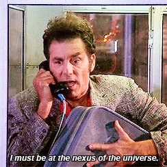
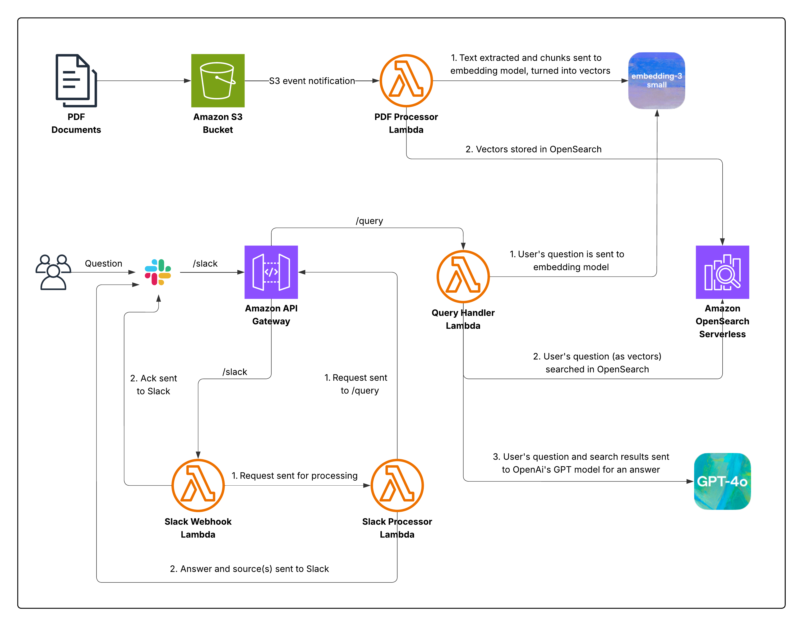

# ai-knowledge-nexus

Build a Slack bot that uses AI to query your PDFs. This solution combines vector search and LLMs ([Retrieval-Augmented Generation](https://en.wikipedia.org/wiki/Retrieval-augmented_generation)). See my [blog](https://medium.com/p/e137b77e2aa0) for how it works.



### Architecture



### Configuration

The code assumes OpenAI as the AI provider. Models and secrets can be configured in `cdk.context.json`:

```json
{
  "secrets": {
    "openaiApiKey": "REDACTED",
    "slackBotToken": "REDACTED",
    "slackSigningSecret": "REDACTED"
  },
  "openaiSettings": {
    "embeddingModel": "text-embedding-3-small",
    "embeddingVectorLength": "1536",
    "chatModel": "gpt-4o"
  }
}
```

Set up the CDK:

```bash
npm install
```

### Deployment

The deployment is broken up into two CDK (CloudFormation) stacks, in case you want the API and not the Slack integration.

Set your AWS credentials and deploy the API and PDF processor & query handler Lambdas:

```bash
cdk deploy AiPdfProcessorStack
```

Deploy the Slack bot integration Lambdas:

```bash
cdk deploy AiSlackBotStack

# We need to force redeployment of the API Gateway stage, as we deployed it in the 1st stack
API_ID=$(aws cloudformation describe-stacks \
  --stack-name AiPdfProcessorStack \
  --query 'Stacks[0].Outputs[?OutputKey==`ApiUrl`].OutputValue' \
  --output text | cut -d'/' -f3 | cut -d'.' -f1)

aws apigateway create-deployment --rest-api-id $API_ID --stage-name prod
```

### Testing

The API is IAM-protected, so first install `awscurl` so we can make signed requests against it:

```bash
pip install awscurl
```

You can upload example PDFs to the S3 bucket with the script below. You can also upload your own PDFs directly to the S3 bucket via the AWS Console or AWS CLI. **Note**: This is **not** currently idempotent. Only upload individual PDFs once.

```bash
./scripts/upload_pdfs.sh
```

Run queries:

```bash
./scripts/run_queries.sh
```

### Security

API Gateway uses IAM authorization for all endpoints except `/slack`. This one must be public because Slack needs access, but verification is done in the Lambda.
